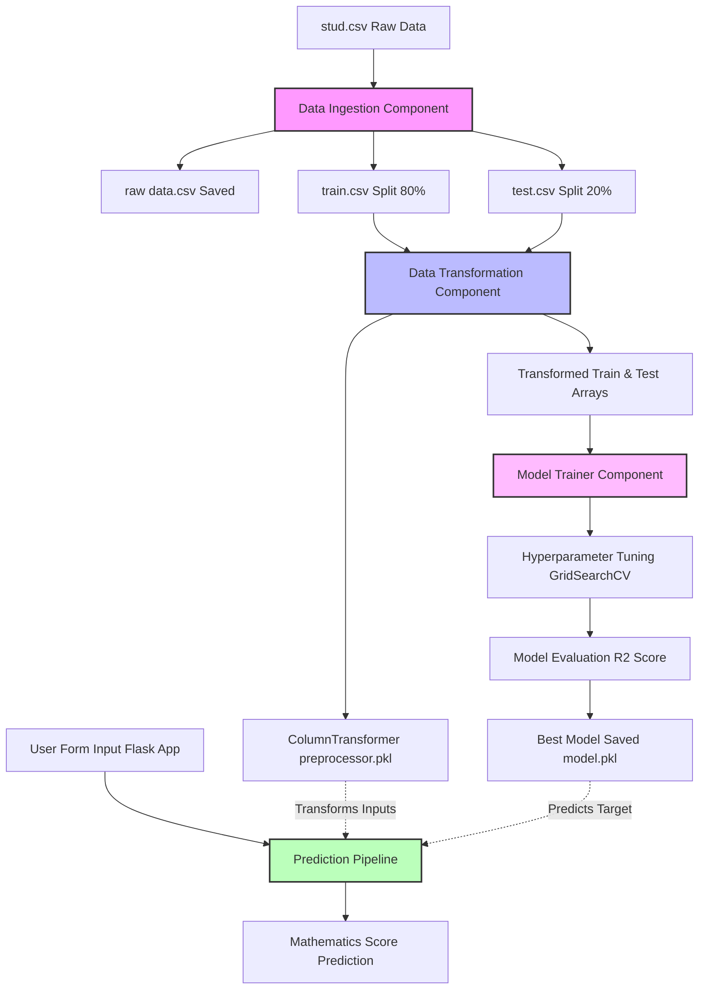
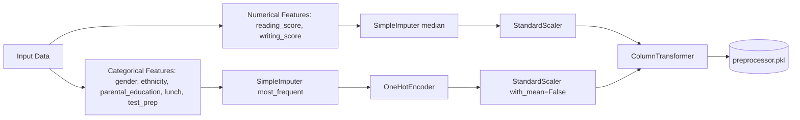

# 🎓 Student Academic Performance Predictor

An End-to-End Machine Learning Web Application designed to analyze student demographic and academic indicators to predict their mathematics scores. The project is structured using enterprise-grade MLOps best practices, featuring modular code, customized data ingestion and preprocessing pipelines, automated model evaluation with hyperparameter tuning, containerization, and AWS deployment configurations.

---

## 📋 Table of Contents
- [Project Overview](#-project-overview)
- [Key Features](#-key-features)
- [Technology Stack](#-technology-stack)
- [Project Architecture](#%EF%B8%8F-project-architecture)
- [Directory Structure](#-directory-structure)
- [Data Pipeline Details](#-data-pipeline-details)
  - [1. Data Ingestion](#1-data-ingestion)
  - [2. Data Transformation](#2-data-transformation)
  - [3. Model Training & Tuning](#3-model-trainer-and-tuning)
- [Web Application & Predict Pipeline](#-web-application--predict-pipeline)
- [Installation & Local Setup](#-installation--local-setup)
- [Docker Containerization](#-docker-containerization)
- [Deployment (AWS Elastic Beanstalk)](#-deployment-aws-elastic-beanstalk)
- [Author & License](#-author--license)

---

## 🔍 Project Overview

Understanding the factors influencing student performance is a key concern for educators and policymakers. This project uses machine learning regression models to predict a student's **math score** (out of 100) using the following features:
*   **Demographics:** Gender, Race/Ethnicity, parental level of education.
*   **Student Info:** Lunch type (standard vs. free/reduced), completion of test preparation course.
*   **Academic History:** Scores in reading and writing.

The project transitions from Jupyter notebook experimentation to a production-ready Flask web application, structured cleanly into modular components.

---

## ⚡ Key Features

*   **Modular Architecture:** Separate components for Data Ingestion, Data Transformation, and Model Training.
*   **Robust Preprocessing:** Automation of missing value imputation, scaling, and categorical encoding using custom Scikit-learn pipelines.
*   **Hyperparameter Tuning:** Multi-model assessment using `GridSearchCV` to automatically identify the best regressor.
*   **Custom Logging & Exceptions:** Tracking execution status and detailed traceback error logs to simplify debugging.
*   **Containerized Environment:** Pre-configured `Dockerfile` for seamless deployment.
*   **Cloud Ready:** Out-of-the-box configurations for AWS Elastic Beanstalk deployment.

---

## 🛠️ Technology Stack

*   **Language:** Python 3.9
*   **Libraries:** Pandas, NumPy, Scikit-Learn, Seaborn, Matplotlib, XGBoost, CatBoost, Dill
*   **Web Framework:** Flask
*   **Containerization:** Docker
*   **Cloud Platform:** AWS Elastic Beanstalk (WSGI environment)

---

## 🗺️ Project Architecture

The architecture flow outlines the complete process from the raw dataset to model prediction via the Flask interface.



---

## 📁 Directory Structure

```text
Student_performance_prediction/
├── .ebextensions/            # AWS Elastic Beanstalk configurations
│   └── python.config         # WSGI path routing config
├── artifacts/                # Directory for intermediate and serialized assets
│   ├── data.csv              # Copy of raw dataset
│   ├── train.csv             # Train split
│   ├── test.csv              # Test split
│   ├── preprocessor.pkl      # Preprocessing Pipeline (ColumnTransformer)
│   └── model.pkl             # Best trained model instance
├── notebook/                 # Notebooks used for early experimentation
│   ├── data/
│   │   └── stud.csv          # Raw data source
│   ├── 1 . EDA STUDENT PERFORMANCE .ipynb
│   └── 2. MODEL TRAINING.ipynb
├── src/                      # Core Source Code Package
│   ├── components/           # Machine Learning Pipeline Steps
│   │   ├── __init__.py
│   │   ├── data_ingestion.py
│   │   ├── data_transformation.py
│   │   └── model_trainer.py
│   ├── pipeline/             # Prediction and execution pipelines
│   │   ├── __init__.py
│   │   ├── predict_pipeline.py
│   │   └── train_pipeline.py
│   ├── __init__.py
│   ├── exception.py          # Custom exception handling utility
│   ├── logger.py             # Basic logging formatter configuration
│   └── utils.py              # Common utilities (Pickle serialization, evaluation)
├── templates/                # Flask UI templates
│   ├── home.html             # Main prediction input form
│   └── index.html            # Basic landing page
├── .gitignore
├── app.py                    # Local Flask application server
├── application.py            # AWS WSGI entry point (production configuration)
├── Dockerfile                # Containerization setup
├── requirements.txt          # Third-party dependencies
└── setup.py                  # Local module packager configuration
```

---

## ⚙️ Data Pipeline Details

### 1. Data Ingestion
Located in [data_ingestion.py](file:///d:/performance_predict/Student_performance_prediction/src/components/data_ingestion.py):
*   Reads the student performance data (`stud.csv`) from the local directories.
*   Saves the raw dataset copy under `artifacts/data.csv`.
*   Splits the data into training (80%) and testing sets (20%) using `train_test_split`.
*   Saves the split datasets as `train.csv` and `test.csv` inside the `artifacts/` folder.

### 2. Data Transformation
Located in [data_transformation.py](file:///d:/performance_predict/Student_performance_prediction/src/components/data_transformation.py):
Applies different preprocessing techniques to Numerical and Categorical data, structured through a unified `ColumnTransformer` object:



*   **Numerical Pipeline:** Fills missing values with the median, then normalizes using a `StandardScaler`.
*   **Categorical Pipeline:** Replaces missing categories with the most frequent value, applies `OneHotEncoder`, and scales results with a non-centered `StandardScaler`.
*   The final transformer object is serialized to `artifacts/preprocessor.pkl`.

### 3. Model Trainer and Tuning
Located in [model_trainer.py](file:///d:/performance_predict/Student_performance_prediction/src/components/model_trainer.py):
Executes training and evaluation for multiple models, tuning their parameters through `GridSearchCV`:

| Model Name | Main Tuning Parameters |
| :--- | :--- |
| **Linear Regression** | None |
| **Decision Tree** | Split Criterion |
| **Random Forest** | Estimator count (`n_estimators`) |
| **Gradient Boosting** | Learning rates, Subsamping, Estimators |
| **XGBRegressor** | Learning rates, Estimators |
| **CatBoosting Regressor** | Depth, Learning rates, Iterations |
| **AdaBoost Regressor** | Learning rates, Estimators |

The code selects the best model based on the highest $R^2$ score on test split. If the score is less than `0.6`, it triggers an exception. The optimized model is serialized as `artifacts/model.pkl`.

---

## 🖥️ Web Application & Predict Pipeline

The user interfaces with the model through a Flask backend (`app.py` / `application.py`).

1.  **Form Submission:** The user fills out details (gender, ethnicity, parental education, lunch type, preparation course, writing & reading score) in `templates/home.html`.
2.  **Custom Data Instance:** [predict_pipeline.py](file:///d:/performance_predict/Student_performance_prediction/src/pipeline/predict_pipeline.py) converts form values into a Structured Pandas DataFrame.
3.  **Inference:** It loads the pre-configured `preprocessor.pkl` and `model.pkl` files, transforms the new inputs, and returns the predicted mathematics score to the HTML page.

---

## 🚀 Installation & Local Setup

To run this project on your local machine, follow these instructions:

### Prerequisites
*   Python 3.9+ installed.
*   Git installed.

### Setup Instructions
1.  **Clone the Repository:**
    ```bash
    git clone <repository-url>
    cd Student_performance_prediction
    ```

2.  **Create and Activate a Virtual Environment:**
    ```bash
    # On Windows:
    python -m venv env
    .\env\Scripts\activate

    # On macOS/Linux:
    python3 -m venv env
    source env/bin/activate
    ```

3.  **Install Package Dependencies:**
    ```bash
    pip install -r requirements.txt
    ```

4.  **Install the Project as a Local Package:**
    This registers the `src` directory as a package utilizing the `setup.py` configurations:
    ```bash
    pip install -e .
    ```

5.  **Trigger Data Ingestion & Model Training:**
    Execute the ingestion script to split data, transform features, run parameter grids, and save the `.pkl` artifacts:
    ```bash
    python src/components/data_ingestion.py
    ```

6.  **Run the Web Application:**
    ```bash
    python app.py
    ```
    Open `http://127.0.0.1:5000/` in your web browser. To access the input form directly, navigate to `http://127.0.0.1:5000/predictdata`.

---

## 🐳 Docker Containerization

To package the application inside a container:

1.  **Build the Docker Image:**
    ```bash
    docker build -t student-performance-predictor .
    ```

2.  **Run the Container:**
    ```bash
    docker run -p 5000:5000 student-performance-predictor
    ```
    Access the application at `http://localhost:5000`.

---

## ☁️ Deployment (AWS Elastic Beanstalk)

This project contains deployment scripts customized for AWS Elastic Beanstalk:

*   **Application entry point:** AWS uses WSGI routers that look for an entry file called `application.py` and a variable named `application`. This mapping is configured at the root level of `application.py`.
*   **EB Configurations:** The `.ebextensions/python.config` file explicitly binds the WSGI runner path to the Flask application:
    ```yaml
    option_settings:
      "aws:elasticbeanstalk:container:python":
        WSGIPath: application:application
    ```

### Basic EB Deployment Steps
1.  Initialize your Elastic Beanstalk workspace using EB CLI: `eb init`
2.  Create your environment: `eb create student-performance-env`
3.  Deploy code changes: `eb deploy`

---

## 📄 Author & License

*   **Author:** Aarna ([aarnasingh812@gmail.com](mailto:aarnasingh812@gmail.com))
*   **License:** Open Source / MIT
